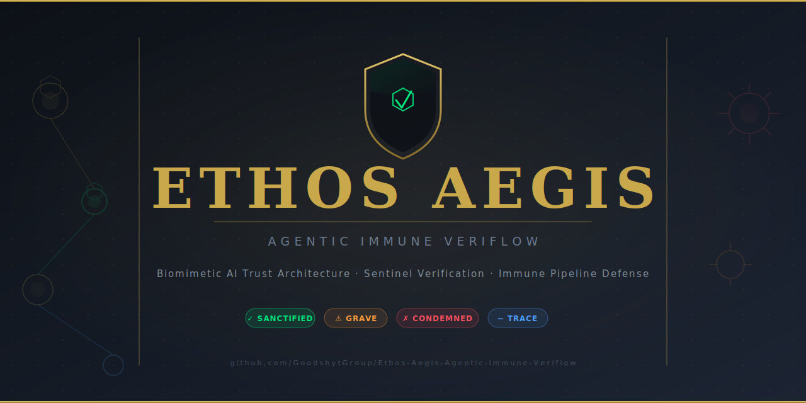

# Ethos Aegis Branding

## Logo References

- - 
+ 

+ ## Social Preview Banner
+ 

- - 
+ 

- - [Brand Guidelines](https://example.com/path/to/brand-guidelines.pdf)
+ - [Brand Guidelines](brand/brand_guidelines.md)
## Color System Integration
- Primary Color: #005EB8
- Secondary Color: #FF6B00
- Accent Color: #FFFFFF

## Styled Badges

This document promotes a verification-first approach in branding. Ensure these assets are used consistently across all platforms to maintain brand integrity.
