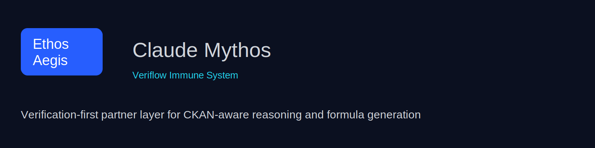

# Ethos Aegis Branding
<p align="center">
  
</p>

<p align="center">
  
</p>

# Ethos Aegis — Agentic Immune Veriflow

## Logo References


## Social Preview Banner


## Brand Assets
- [Brand Guidelines](brand/brand_guidelines.md)
- [Download Logo](brand/logo.svg)

## Color System Integration
- Primary Color: #005EB8
- Secondary Color: #FF6B00
- Accent Color: #FFFFFF

## Styled Badges


---

## 🎬 Demo

<p align="center">
  
</p>

---

## 🚀 Quick Start

### Python (Ethos Aegis / Veriflow)

```bash
# Install dependencies
pip install -r requirements.txt

# Run the test suite
pytest tests/ -q

# Run linting
flake8 ethos_aegis/ tests/
```

### TypeScript (Cloudflare Worker)

```bash
# Install dependencies
npm install

# Type-check
npm run typecheck

# Local dev
npm run worker:dev
```

### Using Make

```bash
make help          # Show all commands
make test          # Run all tests
make lint          # Run all linters
make install       # Install all dependencies
```

---

## 🏗️ Architecture

```
ethos_aegis/
├── mythos_runtime/        # Claude Mythos operating layer
│   ├── budget.py          # Token/turn budget metering
│   ├── drift.py           # File drift detection
│   ├── memory.py          # Memory ledger (MEMORY.md)
│   └── swd.py             # Strict Write Discipline verification
└── veriflow/
    ├── ckan_adapter.py    # CKAN host fingerprinting + ingestion
    └── immune_system.py   # VeriflowImmuneSystem orchestration

src/
└── index.ts               # Cloudflare Worker entrypoint

tests/
├── test_mythos_runtime.py
└── test_mythos_brand_contract.py
```

---

## 🛡️ Core Principles

- **Defense-first** — never exploit-first
- **Verification before conclusion** — every dataset is fingerprinted
- **Provenance before confidence** — ingestion path is always logged
- **Autonomic monitoring** — before manual prompting
- **Schema-aware reasoning** — graceful fallback when schema unavailable

---

## 📋 Runtime Doctrine (Claude Mythos)

1. Probe the host
2. Cache capabilities
3. Select the best ingestion path
4. Verify normalized rows
5. Generate candidate laws and formulas
6. Score by fit, semantics, coverage, stability, and complexity
7. Return the answer with host profile, evidence, and ingestion provenance

---

## 🔌 Integration

```python
from ethos_aegis.veriflow import CKANClient, VeriflowImmuneSystem

ckan = CKANClient("https://your-ckan-host")
immune = VeriflowImmuneSystem(
    ckan,
    probe_on_startup=True,
    fingerprint_mode="auto",
)
```

---

## 📦 Project Structure

```
.
├── ethos_aegis/           # Python: core immune system
├── src/                   # TypeScript: Cloudflare Worker
├── tests/                 # Python test suite
├── docs/                  # Documentation
├── scripts/               # Utility scripts
├── plugins/               # Claude Code plugins
├── schemas/               # JSON/YAML schemas
└── veriflow-Sovereign-Lattice/  # Veriflow sovereign lattice module
```

---

## 🤝 Contributing

See [CONTRIBUTING.md](./CONTRIBUTING.md) for contribution guidelines.

---

## 📄 License

MIT — see [LICENSE](./LICENSE).

---

## 🔗 Related

- [CLAUDE_MYTHOS.md](./CLAUDE_MYTHOS.md) — Operating contract for the Claude Mythos identity layer
- [CHANGELOG.md](./CHANGELOG.md) — Release history
- [SECURITY.md](./SECURITY.md) — Security policy

This document promotes a verification-first approach in branding. Ensure these assets are used consistently across all platforms to maintain brand integrity.