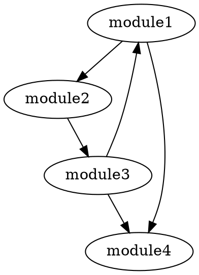

# Code Dependency Analyzer Prompt

## Purpose
Identify, visualize, and analyze code dependencies within a project to understand the relationships between files and modules.

## Input
- Project files (source code)
- File structure data (from File Path Extractor)
- Optional: existing dependency maps

## Processing Instructions

1. **Dependency Extraction**
   - Parse source code to identify imports, requires, and references
   - Extract dependent module names and paths
   - Map internal vs. external dependencies
   - Identify circular dependencies

2. **Dependency Classification**
   - Direct dependencies (explicitly imported/required)
   - Indirect dependencies (transitive relationships)
   - Dev dependencies vs. runtime dependencies
   - Optional vs. required dependencies

3. **Impact Analysis**
   - Calculate dependency weights (how many other modules depend on a module)
   - Identify critical path dependencies
   - Flag high-risk dependencies (highly coupled components)

## Output Formats

### Dependency Matrix
```
             | module1 | module2 | module3 | module4 |
-------------|---------|---------|---------|---------|
module1      |    -    |    X    |         |    X    |
module2      |         |    -    |    X    |         |
module3      |    X    |         |    -    |    X    |
module4      |         |         |         |    -    |
```

### Dependency Graph (DOT format)


### JSON Dependency Map
```json
{
  "module1": {
    "imports": ["module2", "module4"],
    "importedBy": ["module3"],
    "weight": 2,
    "circular": true
  },
  "module2": {
    "imports": ["module3"],
    "importedBy": ["module1"],
    "weight": 1,
    "circular": false
  },
  ...
}
```

## Example Analysis

Input:
```
src/
  ├── app.js
  ├── utils/
  │   ├── helpers.js
  │   └── config.js
  └── components/
      ├── Header.js
      └── Footer.js
```

Output:
```json
{
  "dependency_map": {
    "src/app.js": {
      "imports": ["src/components/Header.js", "src/components/Footer.js", "src/utils/config.js"],
      "importedBy": [],
      "weight": 0,
      "critical": true
    },
    "src/components/Header.js": {
      "imports": ["src/utils/helpers.js"],
      "importedBy": ["src/app.js"],
      "weight": 1,
      "critical": false
    },
    "src/components/Footer.js": {
      "imports": ["src/utils/helpers.js"],
      "importedBy": ["src/app.js"],
      "weight": 1,
      "critical": false
    },
    "src/utils/helpers.js": {
      "imports": [],
      "importedBy": ["src/components/Header.js", "src/components/Footer.js"],
      "weight": 2,
      "critical": false
    },
    "src/utils/config.js": {
      "imports": [],
      "importedBy": ["src/app.js"],
      "weight": 1,
      "critical": false
    }
  },
  "analysis": {
    "most_dependent": "src/utils/helpers.js",
    "entry_points": ["src/app.js"],
    "circular_dependencies": []
  }
}
```

## Advanced Options

### Module Bundling Optimization
- Identify opportunities for code splitting
- Suggest module reorganization to minimize bundle size
- Calculate potential performance improvements

### Dependency Health Metrics
- Cohesion scores (modules with related responsibilities)
- Coupling metrics (dependency density)
- Fragility index (risk assessment based on dependency patterns)

### Refactoring Recommendations
- Identify tightly coupled modules that should be decoupled
- Suggest dependency injection opportunities
- Highlight potential encapsulation problems

### Language-Specific Analysis
```
# JavaScript/TypeScript
--parse-imports --parse-requires --detect-dynamic-imports

# Python
--parse-imports --detect-relative-imports

# Java/Kotlin
--parse-imports --detect-annotations --include-inheritance
```

## Integration with Other Tools
This analyzer works best in conjunction with:
- File Path Extractor (for project structure)
- File Hierarchy Visualizer (for visual context)
- Code Quality Analyzers (for deeper code insights)

## Notes
- Analysis depth can be configured based on project size
- External dependencies can be included or excluded from analysis
- Performance considerations for large codebases include incremental analysis