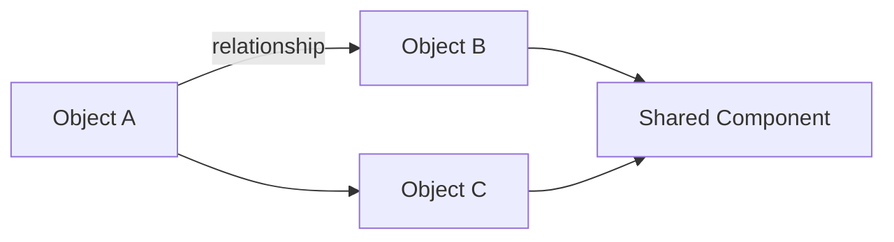
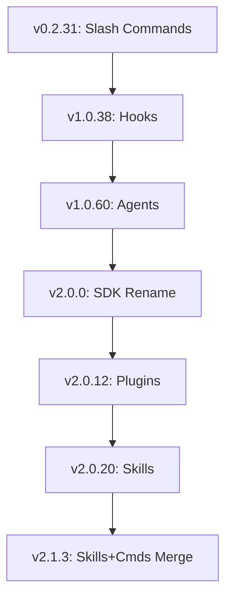
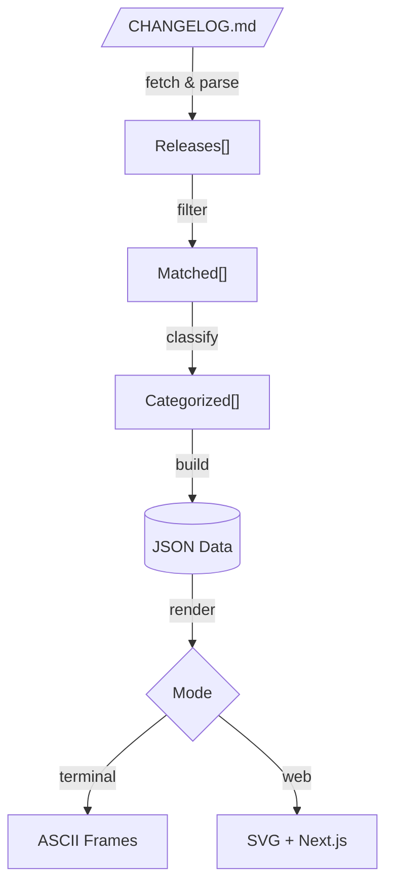

# Deterministic Process: Filter a CHANGELOG.md Feature Into Visual Output

## Purpose

This document describes a **repeatable, deterministic process** for extracting a single feature (or feature family) from a semver-organized `CHANGELOG.md`, and producing visual output in multiple formats:

1. **Terminal ASCII Animation** — Ghostty-style frame-by-frame animation with ANSI 256-color
2. **Terminal ASCII Static** — Single beautiful-mermaid ASCII render
3. **Web SVG** — Next.js app with beautiful-mermaid SVG + CSS/SMIL animation
4. **Mermaid Source** — Raw `.mmd` files for reuse in other tools

It is designed to be given to an LLM (or followed by a human) to produce consistent, comparable output for any feature.

## Architecture Overview

```
┌──────────────────────────────────────────────────────────────────────┐
│                    Deterministic Visual Pipeline                      │
│                                                                      │
│  CHANGELOG.md ──→ Parse ──→ Filter ──→ Classify ──→ Build JSON      │
│                                                           │          │
│                                                           ▼          │
│                                                    ┌─── Render ───┐  │
│                                                    │              │  │
│                                                    ▼              ▼  │
│                                            ┌────────────┐ ┌────────┐│
│                                            │  Terminal   │ │  Web   ││
│                                            │            │ │        ││
│                                            │ Mermaid→   │ │ Next.js││
│                                            │ ASCII→     │ │ +      ││
│                                            │ Ghostty    │ │ b-maid ││
│                                            │ Frames     │ │ SVG    ││
│                                            └────────────┘ └────────┘│
└──────────────────────────────────────────────────────────────────────┘
```

## Dependencies

| Dependency | Purpose | Required? |
|-----------|---------|-----------|
| [beautiful-mermaid](https://github.com/vercel-labs/beautiful-mermaid) | Mermaid → SVG/ASCII rendering with themes | For web-svg and enhanced ASCII |
| [Next.js](https://github.com/vercel/next.js) | Web application framework | For web-svg mode only |
| [agent-browser](https://agent-browser.dev/) | Browser automation for testing | Optional, for web validation |
| [agent-skills](https://github.com/vercel-labs/agent-skills) | Skill packaging format | For skill distribution |
| [skills CLI](https://github.com/vercel-labs/skills) | Skill installation | For `npx skills add` |
| Node.js | Animation engine runtime | For all modes |

---

## Inputs

| Input | Description | Example |
|-------|-------------|---------|
| `CHANGELOG_URL` | Raw URL to the changelog | `https://raw.githubusercontent.com/.../CHANGELOG.md` |
| `FEATURE_NAME` | Human-readable name of the feature family | `Agent Skills` |
| `FEATURE_KEYWORDS` | List of keywords/phrases to match entries | `["skill", "agent", "hook", "plugin"]` |
| `OUTPUT_DIR` | Directory for output files | `deterministic-object-usage/output/` |
| `CATEGORIES` | Feature sub-categories for filtering/tagging | `[{"id": "skill", "label": "Skills", "color": [88,166,255]}]` |
| `RENDER_MODE` | Output mode | `ascii-animate`, `ascii-static`, `web-svg`, `mermaid` |
| `THEME` | beautiful-mermaid theme name | `vercel-dark`, `dracula`, `nord`, etc. |

---

## Step-by-Step Process

### Step 1: Fetch & Parse the Changelog

1. Fetch the full `CHANGELOG.md` from `CHANGELOG_URL`
2. Parse it into a structured list of releases:
   ```
   Release {
     version: string        // semver, e.g. "2.1.33"
     entries: string[]      // bullet-point items
   }
   ```
3. Releases are delimited by `## <version>` headings
4. Each bullet (`- ...`) under a heading is one entry

### Step 2: Filter Entries by Feature Keywords

For each release, for each entry:

1. Check if the entry text matches **any** keyword in `FEATURE_KEYWORDS` (case-insensitive)
2. If it matches, include it. If not, discard it
3. Discard releases that end up with zero matching entries

**Keyword matching rules:**
- Match as substrings (e.g., "skill" matches "Skills defined in...")
- Match code references (e.g., `.claude/skills` matches `` `.claude/skills/` ``)
- Match related tool/object names

### Step 3: Classify Each Entry

For each matching entry, assign:

#### 3a. Categories (one or more from `CATEGORIES`)
Map each entry to the most relevant sub-category(ies).

#### 3b. Change Type
Classify as: `added`, `changed`, `fixed`, or `removed`

#### 3c. Objects & Parameters
Extract named objects and parameters referenced in each entry.

#### 3d. Milestone Detection
Mark significant releases with labels: `["introduced"]`, `["major"]`, `["breaking"]`.

### Step 4: Build the Data Structure

Produce a JSON structure with this shape:

```javascript
const RELEASES = [
  {
    version: "2.0.20",
    milestone: true,
    labels: ["introduced"],
    changes: [
      {
        cats: ["skill"],
        type: "added",
        desc: "Description...",
        objects: ["Skill", ".claude/skills/", "SKILL.md"],
        params: { "allowed-tools": "string[]" }
      }
    ]
  }
];
```

### Step 5: Generate Mermaid Diagrams

From the structured data, generate mermaid diagrams:

#### 5a. Architecture Diagram (flowchart)

Generate a `graph LR` showing current-state relationships between feature objects:
- Boxes for each major object type (color-coded by category)
- Arrows showing interactions
- Shared fields at the bottom



#### 5b. Evolution Timeline (flowchart TD)

Generate a `graph TD` showing feature evolution milestones:



#### 5c. Data Flow Diagram (flowchart TD)

Generate a `graph TD` showing the processing pipeline:



### Step 6: Render Output

Based on `RENDER_MODE`:

#### 6a. `mermaid` — Save `.mmd` files

Write the generated mermaid diagrams to `OUTPUT_DIR/`:
```
OUTPUT_DIR/
  NNN-feature-architecture.mmd
  NNN-feature-timeline.mmd
  NNN-feature-dataflow.mmd
```

#### 6b. `ascii-static` — Single terminal frame

Use the deterministic-visual skill's render script:
```bash
./plugins/deterministic-visual/skills/deterministic-visual/scripts/render.sh \
  --mode ascii-static \
  --input OUTPUT_DIR/NNN-feature-architecture.mmd \
  --theme THEME \
  --width 120
```

Output: rendered ASCII art to stdout or file.

#### 6c. `ascii-animate` — Ghostty-style terminal animation

```bash
./plugins/deterministic-visual/skills/deterministic-visual/scripts/render.sh \
  --mode ascii-animate \
  --input OUTPUT_DIR/NNN-feature-architecture.mmd \
  --theme THEME \
  --fps 30
```

Output: animated frames rendered to terminal at 30fps.

The animation engine:
1. Parses mermaid into nodes/edges graph
2. Computes rank-based spatial layout
3. Generates progressive-reveal frames (nodes appear rank-by-rank)
4. Renders frames using ANSI 24-bit color + cursor repositioning
5. Plays at target FPS with flicker-free updates via `\033[H`

#### 6d. `web-svg` — Next.js + beautiful-mermaid

```bash
./plugins/deterministic-visual/skills/deterministic-visual/scripts/render.sh \
  --mode web-svg \
  --input OUTPUT_DIR/NNN-feature-architecture.mmd \
  --theme THEME \
  --port 3000
```

Output: scaffolds a Next.js app with:
- beautiful-mermaid SVG rendering (CSS/SMIL animation)
- Theme switcher using CSS custom properties
- Ghostty-style FramePlayer component for ASCII-in-browser mode
- Server-side rendering via API route

---

## Naming Convention

Output files follow this pattern:

```
deterministic-object-usage/
  000-claude-filter-changelog-feature-to-html-prompt.md    # Original HTML process
  001-deterministic-visual-process.md                       # This file (mermaid+ASCII process)
  002-claude-agent-skills.html                              # Existing HTML output
  003-claude-agent-skills-architecture.mmd                  # Mermaid: architecture
  004-claude-agent-skills-timeline.mmd                      # Mermaid: milestone timeline
  005-claude-agent-skills-dataflow.mmd                      # Mermaid: data flow
```

The `NNN` prefix is a sequence number. Output formats are determined by file extension.

---

## Example Prompt for LLM Execution

```
Fetch the changelog at:
  https://raw.githubusercontent.com/anthropics/claude-code/refs/heads/main/CHANGELOG.md

Filter it for the feature: "MCP Servers"

Use these keywords:
  ["MCP", "mcp", ".mcp.json", "MCP server", "SSE", "streamable HTTP", "OAuth", "MCP tool"]

Categories:
  [
    {"id": "mcp-core", "label": "MCP Core", "color": [88, 166, 255]},
    {"id": "mcp-transport", "label": "Transport", "color": [63, 185, 80]},
    {"id": "mcp-auth", "label": "Auth/OAuth", "color": [210, 168, 255]},
    {"id": "mcp-config", "label": "Configuration", "color": [240, 136, 62]}
  ]

Render mode: ascii-animate
Theme: dracula
FPS: 30

Follow the process defined in:
  deterministic-object-usage/001-deterministic-visual-process.md

Use the deterministic-visual skill from:
  plugins/deterministic-visual/
```

---

## Quality Checklist

Before considering the output complete, verify:

- [ ] Every matching changelog entry is included (no false negatives)
- [ ] No unrelated entries are included (no false positives)
- [ ] Every entry has at least one category and one change type
- [ ] Milestone releases are correctly identified
- [ ] Mermaid diagrams parse without syntax errors
- [ ] Architecture diagram reflects **current** state (latest release)
- [ ] ASCII output fits within terminal width (120 columns default)
- [ ] Color theme applies consistently across nodes/edges
- [ ] Animation frames transition without flicker
- [ ] Box-drawing characters align correctly (no gaps)
- [ ] ANSI reset codes prevent color bleed between elements
- [ ] Terminal cleanup runs on exit (cursor restored, colors reset)
- [ ] Web SVG (if used) matches terminal ASCII in structure
- [ ] Mermaid `.mmd` files are valid and reusable

---

## Integration with Plugin Ecosystem

This process is packaged as the **deterministic-visual** plugin:

```
plugins/deterministic-visual/
├── .claude-plugin/plugin.json     # Plugin metadata
├── skills/deterministic-visual/   # The skill
│   ├── SKILL.md                   # Skill definition + instructions
│   ├── scripts/
│   │   ├── render.sh              # Main entrypoint
│   │   └── ascii-animate.js       # Ghostty-style animation engine
│   ├── references/
│   │   ├── animation-spec.md      # Frame animation specification
│   │   ├── theme-reference.md     # beautiful-mermaid theme mapping
│   │   ├── mermaid-patterns.md    # Reusable diagram patterns
│   │   └── next-app-template.md   # Next.js web app scaffold
│   └── examples/
│       ├── changelog-flow.mmd     # Changelog pipeline diagram
│       ├── agent-lifecycle.mmd    # Agent sequence diagram
│       ├── plugin-architecture.mmd # Plugin structure diagram
│       └── deterministic-process.mmd # This process as a diagram
├── commands/visualize.md          # /visualize slash command
└── agents/visual-renderer.md      # Rendering subagent
```

Invoke via: `/visualize <input-file> --mode ascii-animate --theme dracula`
