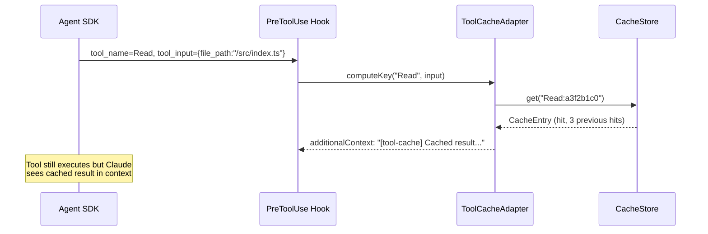
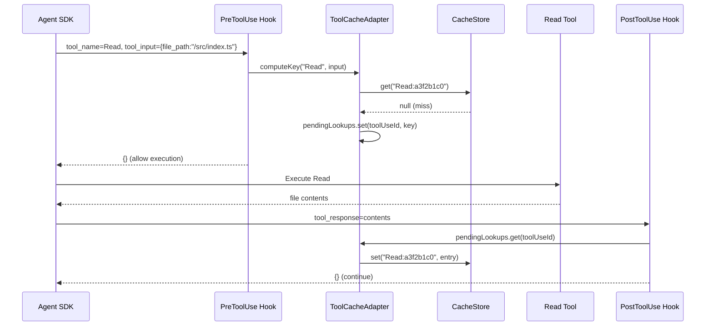
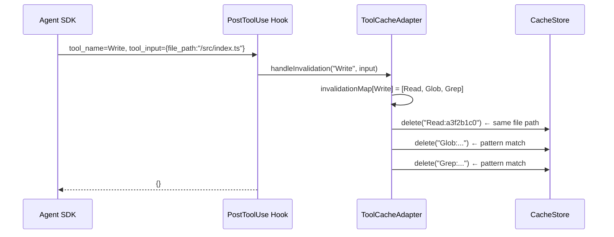

# Tool Cache Adapter — Claude Agent SDK

A hook-based caching layer for every Claude Agent SDK tool. Intercepts `PreToolUse` and `PostToolUse` hooks to serve cached results for idempotent tools and automatically invalidate when mutating tools execute.

## Architecture

```
┌──────────────────────────────────────────────────────────────────────┐
│                        Claude Agent SDK                              │
│                                                                      │
│  query({ prompt, options: { hooks: cache.hooks() } })               │
│                                                                      │
│  ┌─────────────────┐    ┌──────────────────┐    ┌────────────────┐  │
│  │   PreToolUse    │───►│  ToolCacheAdapter │───►│  PostToolUse   │  │
│  │   Hook          │    │                  │    │  Hook          │  │
│  └────────┬────────┘    │  ┌────────────┐  │    └───────┬────────┘  │
│           │             │  │  Policy     │  │            │           │
│           │             │  │  Engine     │  │            │           │
│           │             │  └──────┬─────┘  │            │           │
│           │             │         │        │            │           │
│           │             │  ┌──────▼─────┐  │            │           │
│           │             │  │   Cache    │  │            │           │
│           │             │  │   Store    │  │            │           │
│           │             │  └────────────┘  │            │           │
│           │             └──────────────────┘            │           │
│           │                                             │           │
│    ┌──────▼──────────────────────────────────────────────▼──────┐   │
│    │                     Tool Execution                         │   │
│    │  Read · Glob · Grep · WebSearch · WebFetch · Bash · ...   │   │
│    └───────────────────────────────────────────────────────────┘   │
└──────────────────────────────────────────────────────────────────────┘
```

## Quick Start

### In-Memory Cache (default)

```typescript
import { query } from "@anthropic-ai/claude-agent-sdk";
import { ToolCacheAdapter } from "./lib/cache";

const cache = new ToolCacheAdapter({ debug: true });

for await (const message of query({
  prompt: "Find all TODO comments and summarize them",
  options: {
    allowedTools: ["Read", "Glob", "Grep"],
    hooks: cache.hooks(),
  }
})) {
  if ("result" in message) console.log(message.result);
}

// Check cache performance
const stats = await cache.stats();
console.log(`Hits: ${stats.hitCount}, Misses: ${stats.missCount}`);
```

### Neon Persistent Cache

```typescript
import { neon } from "@neondatabase/serverless";
import { ToolCacheAdapter, NeonCacheStore } from "./lib/cache";

const sql = neon(process.env.DATABASE_URL!);
const store = new NeonCacheStore({ sql });
await store.migrate(); // Creates tool_cache table if needed

const cache = new ToolCacheAdapter({
  store,
  debug: true,
});
```

### Custom Tool Policies

```typescript
const cache = new ToolCacheAdapter({
  policies: {
    // Make Read cache last longer
    Read: { ttlMs: 30 * 60 * 1000 }, // 30 min

    // Enable caching for a specific Bash command pattern
    Bash: { strategy: "idempotent", ttlMs: 60_000, maxEntries: 10 },

    // Cache an MCP tool
    "mcp__my-server__fetch_data": {
      strategy: "idempotent",
      ttlMs: 10 * 60 * 1000,
      maxEntries: 25,
    },
  },
});
```

## Default Cache Policies

| Tool | Strategy | TTL | Max Entries | Rationale |
|------|----------|-----|-------------|-----------|
| **Read** | `idempotent` | 5 min | 200 | File reads are stable within a session |
| **Glob** | `idempotent` | 2 min | 100 | Directory listings change less often |
| **Grep** | `idempotent` | 2 min | 100 | Content search on same pattern/path |
| **WebSearch** | `idempotent` | 15 min | 50 | Search results shift slowly |
| **WebFetch** | `idempotent` | 15 min | 50 | Page content cached by URL |
| **Bash** | `never` | — | — | Side effects; opt-in only |
| **Write** | `never` | — | — | Mutating; triggers invalidation |
| **Edit** | `never` | — | — | Mutating; triggers invalidation |
| **Task** | `never` | — | — | Subagent results vary |
| **AskUserQuestion** | `never` | — | — | Interactive; user-dependent |

## Invalidation Map

When a mutating tool executes, the adapter automatically invalidates cached entries for tools that might return stale data:

```
Write ──────► invalidates Read, Glob, Grep (same file path)
Edit ───────► invalidates Read, Grep (same file path)
Bash ───────► invalidates Read, Glob, Grep (all entries)
NotebookEdit► invalidates Read (same file path)
```

Path-specific invalidation: if the mutating tool has a `file_path` input, only cached entries for that exact path are invalidated. Otherwise, all entries for the affected tools are cleared.

## Cache Key Derivation

```
key = "{toolName}:{fnv1a(canonicalJSON(input - excludedFields))}"
```

1. Tool input is filtered (removing fields listed in `excludeFromKey`)
2. Remaining fields are sorted by key name
3. Canonical JSON is computed
4. FNV-1a hash produces the key suffix

Example: `Read:a3f2b1c0` for `{ file_path: "/src/index.ts" }`

## Sequence Diagram — Cache Hit



## Sequence Diagram — Cache Miss → Store



## Sequence Diagram — Write Invalidation



## Cache Store Backends

### MemoryCacheStore (default)

- In-process Map with LRU eviction
- Zero dependencies
- Lost on process restart
- Best for: single-session agents, short-lived tasks

### NeonCacheStore

- Persistent Postgres-backed via `@neondatabase/serverless`
- Survives process restarts
- Shared across multiple agent instances
- Auto-migration with `store.migrate()`
- Periodic cleanup with `store.purgeExpired()`
- Best for: production deployments, long-running agents, shared caches

## API Reference

### `ToolCacheAdapter`

| Method | Returns | Description |
|--------|---------|-------------|
| `hooks()` | `Record<string, HookMatcher[]>` | Hook config for `query()` |
| `stats()` | `Promise<CacheStats>` | Hit/miss/eviction statistics |
| `clear(tool?)` | `Promise<number>` | Clear all or tool-specific entries |
| `invalidate(key)` | `Promise<boolean>` | Remove a specific cache key |
| `invalidateFile(path)` | `Promise<void>` | Invalidate all cached reads for a file |
| `getPolicy(tool)` | `ToolCachePolicy \| null` | Get resolved policy for a tool |

### `ToolCacheAdapterOptions`

| Option | Type | Default | Description |
|--------|------|---------|-------------|
| `policies` | `Record<ToolName, Partial<ToolCachePolicy>>` | `{}` | Override per-tool policies |
| `store` | `CacheStore` | `MemoryCacheStore` | Pluggable backend |
| `maxSizeBytes` | `number` | `50MB` | Memory store max size |
| `debug` | `boolean` | `false` | Log cache hits/misses |
| `invalidationMap` | `Record<string, ToolName[]>` | (see above) | Cross-tool invalidation |
