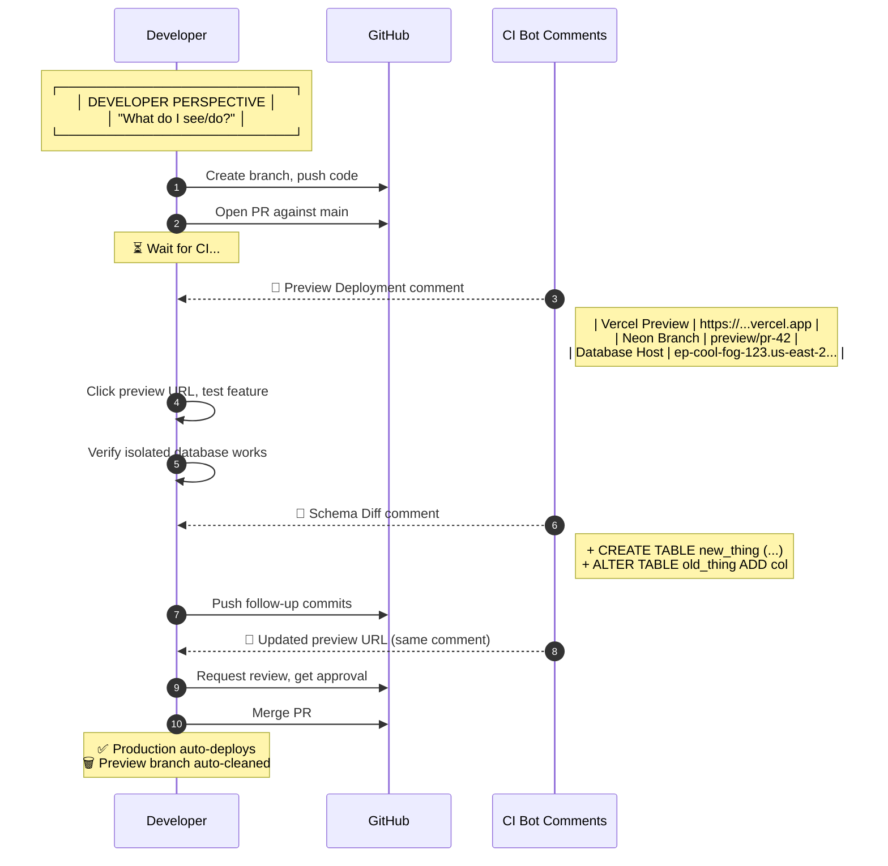
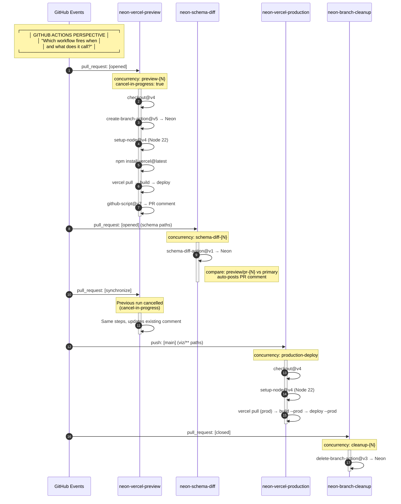
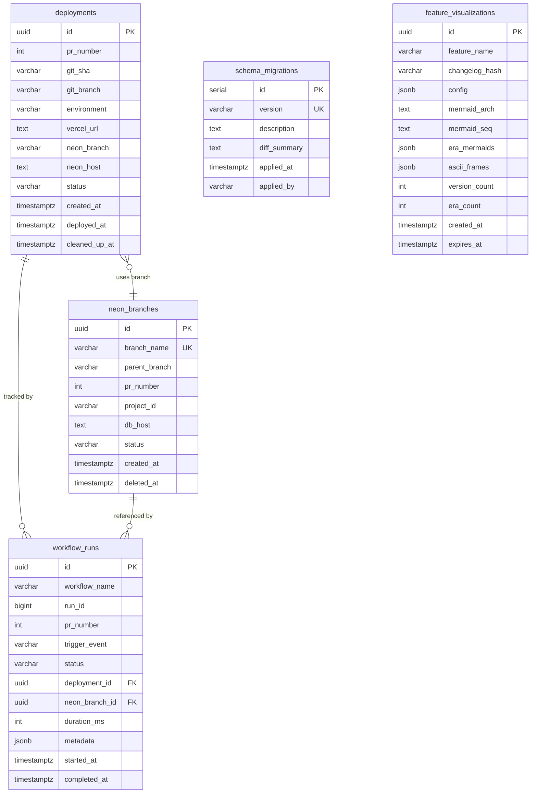

# Neon + Vercel Entity Sequence Diagrams

Five entity perspectives of the PR preview and production deploy lifecycle.

---

## 1. Full System Sequence — All Entities

```mermaid
sequenceDiagram
    autonumber
    participant Dev as Developer
    participant GH as GitHub
    participant GA as GitHub Actions
    participant Neon as Neon Postgres
    participant Vercel as Vercel

    Note over Dev,Vercel: ═══ Feature Branch: PR Preview ═══

    Dev->>GH: git push feature branch
    Dev->>GH: Open pull request
    GH->>GA: trigger: pull_request [opened]

    rect rgb(40, 42, 54)
        Note over GA,Neon: neon-vercel-preview.yml
        GA->>Neon: create-branch-action@v5
        Note right of Neon: branch: preview/pr-{N}<br/>parent: main (primary)
        Neon-->>GA: db_url, db_url_with_pooler, host
    end

    rect rgb(40, 42, 54)
        Note over GA,Vercel: Vercel Preview Build
        GA->>Vercel: vercel pull --environment=preview
        Vercel-->>GA: env vars + project config
        GA->>GA: vercel build (DATABASE_URL=neon_branch)
        GA->>Vercel: vercel deploy --prebuilt
        Vercel-->>GA: preview_url
    end

    GA->>GH: PR comment: preview URL + Neon branch info

    Note over Dev,Vercel: ═══ Schema Change Detection ═══

    rect rgb(30, 50, 40)
        Note over GA,Neon: neon-schema-diff.yml
        GA->>Neon: schema-diff-action@v1
        Note right of Neon: compare: preview/pr-{N}<br/>against: primary
        Neon-->>GA: schema diff result
        GA->>GH: PR comment: schema diff
    end

    Dev->>GH: Push more commits
    GH->>GA: trigger: pull_request [synchronize]
    Note over GA: Repeats preview cycle<br/>(concurrency: cancel-in-progress)

    Note over Dev,Vercel: ═══ Merge to Main: Production ═══

    Dev->>GH: Merge PR
    GH->>GA: trigger: push [main] (matching paths)
    GH->>GA: trigger: pull_request [closed]

    par Production Deploy
        rect rgb(40, 42, 54)
            Note over GA,Vercel: neon-vercel-production.yml
            GA->>Vercel: vercel pull --environment=production
            GA->>GA: vercel build --prod (NODE_ENV=production)
            GA->>Vercel: vercel deploy --prebuilt --prod
            Note right of Vercel: Uses primary Neon branch<br/>from Vercel env vars
        end
    and Branch Cleanup
        rect rgb(50, 30, 30)
            Note over GA,Neon: neon-branch-cleanup.yml
            GA->>Neon: delete-branch-action@v3
            Note right of Neon: deletes: preview/pr-{N}
            Neon-->>GA: branch deleted
        end
    end
```



---

## 2. Developer Perspective



---

## 3. Neon Postgres Perspective

```mermaid
sequenceDiagram
    autonumber
    participant GA as GitHub Actions
    participant API as Neon API
    participant Primary as Primary Branch<br/>(main/production)
    participant Preview as Preview Branch<br/>(preview/pr-N)

    Note over API: ┌──────────────────────────┐<br/>│   NEON DB PERSPECTIVE    │<br/>│  "What happens to my     │<br/>│   branches and data?"    │<br/>└──────────────────────────┘

    Note over Primary: Steady state:<br/>production data + schema

    GA->>API: POST /branches (create-branch-action@v5)
    Note right of GA: project_id: $NEON_PROJECT_ID<br/>branch_name: preview/pr-42<br/>parent: primary

    API->>Primary: Copy-on-write fork
    Primary-->>Preview: Instant branch (zero data copy)
    API-->>GA: { db_url, host, branch_id }

    Note over Preview: Branch exists with<br/>full production schema<br/>+ snapshot of data

    GA->>Preview: Vercel app connects via DATABASE_URL
    Preview->>Preview: Migrations run (if any)
    Preview->>Preview: Seed data inserted (if any)

    Note over Preview: Isolated: writes here<br/>don't affect primary

    GA->>API: POST /schema-diff (schema-diff-action@v1)
    API->>Primary: Read schema
    API->>Preview: Read schema
    API-->>GA: Diff result (DDL changes)

    Note over GA: PR gets additional pushes...<br/>Branch already exists, reused

    GA->>API: DELETE /branches (delete-branch-action@v3)
    Note right of GA: branch: preview/pr-42
    API->>Preview: Delete branch
    destroy Preview
    API-->>GA: 204 No Content

    Note over Primary: Primary unchanged.<br/>No data loss. No schema drift.
```

---

## 4. Vercel Perspective

```mermaid
sequenceDiagram
    autonumber
    participant GA as GitHub Actions
    participant CLI as Vercel CLI
    participant Proj as Vercel Project
    participant Prev as Preview Deploy
    participant Prod as Production Deploy

    Note over CLI: ┌─────────────────────────┐<br/>│  VERCEL PERSPECTIVE     │<br/>│  "What gets built and   │<br/>│   deployed where?"      │<br/>└─────────────────────────┘

    Note over Proj: Project: deterministic-viz<br/>Root: deterministic-object-usage/viz

    rect rgb(40, 42, 54)
        Note over GA,Prev: ── Preview Deploy (per PR) ──
        GA->>CLI: vercel pull --environment=preview
        CLI->>Proj: Fetch preview env vars
        Proj-->>CLI: .vercel/project.json + .env

        GA->>CLI: vercel build
        Note right of CLI: env: DATABASE_URL = Neon branch URL<br/>env: DATABASE_URL_UNPOOLED = direct<br/>working-dir: deterministic-object-usage/viz
        CLI-->>GA: .vercel/output/ (static + serverless)

        GA->>CLI: vercel deploy --prebuilt
        CLI->>Prev: Upload build artifacts
        Prev-->>GA: https://viz-{hash}.vercel.app
    end

    Note over GA: Time passes... PR merged

    rect rgb(30, 50, 40)
        Note over GA,Prod: ── Production Deploy (on merge) ──
        GA->>CLI: vercel pull --environment=production
        CLI->>Proj: Fetch production env vars
        Proj-->>CLI: .vercel/project.json + .env

        GA->>CLI: vercel build --prod
        Note right of CLI: NODE_ENV=production<br/>DATABASE_URL from Vercel dashboard<br/>(primary Neon branch)
        CLI-->>GA: .vercel/output/

        GA->>CLI: vercel deploy --prebuilt --prod
        CLI->>Prod: Upload + promote to production
        Prod-->>GA: https://viz.vercel.app
    end

    Note over Prev: Preview deploy stays alive<br/>until Vercel auto-expires it
    Note over Prod: Production deploy is live<br/>Concurrency: cancel-in-progress
```



---

## 5. GitHub Actions Perspective



---

## ER Diagram — Database Schema



---

## Ghostty-Style ASCII — System Topology

```
╔══════════════════════════════════════════════════════════════════════════╗
║                    NEON + VERCEL DEPLOY TOPOLOGY                       ║
╠══════════════════════════════════════════════════════════════════════════╣
║                                                                        ║
║   ┌─────────┐    push     ┌──────────┐   events   ┌─────────────────┐ ║
║   │         │───────────►│          │───────────►│                 │ ║
║   │   Dev   │            │  GitHub  │            │  GitHub Actions │ ║
║   │         │◄───────────│          │◄───────────│                 │ ║
║   └─────────┘  comments  └──────────┘  comments  └────────┬────────┘ ║
║                                                    ┌───────┴───────┐  ║
║                                                    │               │  ║
║                                                    ▼               ▼  ║
║                                            ┌──────────┐    ┌────────┐ ║
║                                            │          │    │        │ ║
║                                            │   Neon   │    │ Vercel │ ║
║                                            │ Postgres │    │        │ ║
║                                            │          │    │        │ ║
║                                            └──────────┘    └────────┘ ║
║                                                                        ║
╠══════════════════════════════════════════════════════════════════════════╣
║  BRANCH LIFECYCLE                                                      ║
║                                                                        ║
║  PR Open ─────► preview/pr-N ─────► Schema Diff ─────► PR Comment     ║
║       │              │                    │                             ║
║       │              ▼                    ▼                             ║
║       │         ┌─────────┐        ┌──────────┐                       ║
║       │         │  Neon   │        │  Neon    │                       ║
║       │         │ Branch  │◄──────►│ Primary  │                       ║
║       │         │ (fork)  │  diff  │ (main)   │                       ║
║       │         └────┬────┘        └──────────┘                       ║
║       │              │                                                 ║
║       ▼              ▼                                                 ║
║  ┌─────────┐   ┌──────────┐                                          ║
║  │ Vercel  │◄──│ DB URL   │                                          ║
║  │ Preview │   │ injected │                                          ║
║  └─────────┘   └──────────┘                                          ║
║                                                                        ║
║  PR Merge ────► Production Deploy ────► Primary Neon (from env vars)  ║
║       │                                                                ║
║       └───────► Cleanup: delete preview/pr-N branch                   ║
║                                                                        ║
╠══════════════════════════════════════════════════════════════════════════╣
║  SCHEMA TABLE MAP                                                      ║
║                                                                        ║
║  deployments ──────┐                                                   ║
║       │            │                                                   ║
║       │ 1:N        │ N:1                                              ║
║       ▼            ▼                                                   ║
║  workflow_runs ◄──── neon_branches                                    ║
║                                                                        ║
║  schema_migrations     feature_visualizations                         ║
║  (independent)         (cache, 7-day TTL)                             ║
║                                                                        ║
╚══════════════════════════════════════════════════════════════════════════╝
```

---

## Workflow Decision Matrix

```
                    ┌─────────────────────────────────────────────┐
                    │              GitHub Event                    │
                    └──────────────────┬──────────────────────────┘
                                       │
                    ┌──────────────────┼──────────────────┐
                    │                  │                  │
                    ▼                  ▼                  ▼
            pull_request         push [main]       pull_request
          [opened|sync|reopen]   (viz/** paths)      [closed]
                    │                  │                  │
              ┌─────┴─────┐           │                  │
              │           │           │                  │
              ▼           ▼           ▼                  ▼
      ┌──────────┐ ┌───────────┐ ┌──────────┐  ┌──────────────┐
      │ preview  │ │  schema   │ │production│  │   cleanup    │
      │  deploy  │ │   diff    │ │  deploy  │  │ Neon branch  │
      │          │ │           │ │          │  │              │
      │ Neon:    │ │ Neon:     │ │ Vercel:  │  │ Neon:        │
      │  create  │ │  compare  │ │  build   │  │  delete      │
      │  branch  │ │  schemas  │ │  --prod  │  │  branch      │
      │          │ │           │ │  deploy  │  │              │
      │ Vercel:  │ │ GitHub:   │ │  --prod  │  │ preview/     │
      │  pull    │ │  post     │ │          │  │  pr-{N}      │
      │  build   │ │  comment  │ │ DB from  │  │              │
      │  deploy  │ │           │ │ Vercel   │  │              │
      │          │ │ (only on  │ │ env vars │  │              │
      │ GitHub:  │ │  schema   │ │          │  │              │
      │  post    │ │  paths)   │ │          │  │              │
      │  comment │ │           │ │          │  │              │
      └──────────┘ └───────────┘ └──────────┘  └──────────────┘
```
