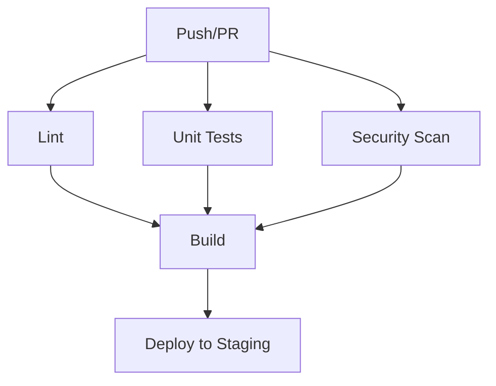
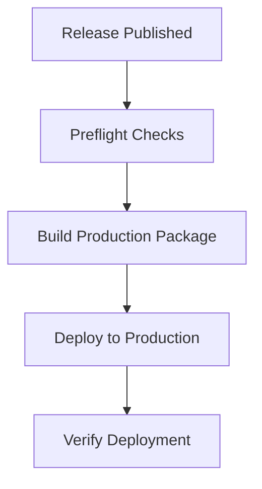

# CI/CD Guide for Claude Neural Framework

This guide explains the Continuous Integration and Continuous Deployment (CI/CD) pipeline for the Claude Neural Framework.

## Overview

The Claude Neural Framework uses GitHub Actions for its CI/CD pipeline, which includes:

1. **Continuous Integration (CI)**: Automatically runs on each push and pull request
2. **Continuous Deployment (CD)**: Automatically deploys to staging on push to main branch
3. **Production Deployment**: Manually triggered or runs on new releases
4. **Dependency Updates**: Automatically checks for updates on a weekly basis

## Workflows

### Main CI Workflow

The main CI workflow (`main.yml`) runs on pushes to `main` and `develop` branches, and on pull requests.

Stages:
1. **Lint**: Checks for code quality and syntax issues
2. **Unit Tests**: Runs unit tests and generates coverage reports
3. **Integration Tests**: Runs integration tests
4. **Security Scan**: Performs security audits and checks
5. **Build**: Creates a distribution package
6. **Deploy to Staging**: Automatically deploys to the staging environment (only on push to `main`)



### Production Deployment Workflow

The production deployment workflow (`production-deploy.yml`) runs when a new release is published or manually triggered.

Stages:
1. **Preflight Checks**: Runs tests and security checks
2. **Build Production Package**: Creates a production-ready package
3. **Deploy to Production**: Deploys to the production environment
4. **Verify Deployment**: Performs health checks and updates the release status



### Dependency Updates Workflow

The dependency updates workflow (`dependency-updates.yml`) runs weekly to check for updates to dependencies.

Stages:
1. **Check for Updates**: Checks for updates to dependencies
2. **Create Pull Request**: Creates a pull request with updated dependencies

## Running CI Locally

To simulate the CI pipeline locally, use the provided script:

```bash
# Run all CI stages
node scripts/run_ci_locally.js

# Run specific stage
node scripts/run_ci_locally.js "Unit Tests"

# Skip optional stages
node scripts/run_ci_locally.js --skip-optional
```

## Environment Variables and Secrets

The CI/CD pipeline requires the following environment variables and secrets:

| Name | Description | Used In |
|------|-------------|---------|
| `DEPLOY_TOKEN` | Token for deploying to staging | Main workflow |
| `PRODUCTION_DEPLOY_TOKEN` | Token for deploying to production | Production workflow |
| `NOTIFICATION_WEBHOOK` | Webhook for deployment notifications | Production workflow |
| `GITHUB_TOKEN` | GitHub API token (provided by Actions) | All workflows |

## Environment Configuration

The framework uses GitHub Environments for managing different deployment targets:

1. **Staging**: Used for testing changes before production
2. **Production**: The live environment

Each environment has its own:
- Protection rules
- Environment variables
- Deployment approvals

## CI/CD Pipeline Architecture

The CI/CD pipeline follows these principles:

1. **Git Flow**: 
   - Feature branches → Develop → Main → Production
   - Each step includes appropriate testing

2. **Test Pyramid**:
   - Unit tests: Fast and numerous
   - Integration tests: Focused on component interactions
   - E2E tests: Limited to critical paths

3. **Security by Design**:
   - Security scanning in each stage
   - Vulnerability checks for dependencies
   - Compliance validation

4. **Immutable Artifacts**:
   - Build once, deploy many times
   - Same artifact moves through environments

## Setting Up Environments

### Staging Environment

1. Go to GitHub repository settings
2. Navigate to Environments
3. Create a new environment named "staging"
4. Add required secrets:
   - `DEPLOY_TOKEN`

### Production Environment

1. Go to GitHub repository settings
2. Navigate to Environments
3. Create a new environment named "production"
4. Add required secrets:
   - `PRODUCTION_DEPLOY_TOKEN`
   - `NOTIFICATION_WEBHOOK`
5. Set up protection rules:
   - Required reviewers
   - Wait timer
   - Deployment branches (restrict to `main`)

## Best Practices

1. **Pull Requests**:
   - Include tests with changes
   - Wait for CI to pass before merging
   - Use PR templates

2. **Commits**:
   - Use semantic commit messages
   - Reference issues in commits
   - Keep commits focused and atomic

3. **Releases**:
   - Use semantic versioning
   - Include detailed release notes
   - Tag releases properly

4. **Monitoring**:
   - Review CI/CD metrics regularly
   - Analyze test failures
   - Monitor deployment success rates

## Troubleshooting

### Common Issues

1. **Failed Tests**:
   - Check the test output
   - Run tests locally
   - Check for environment-specific issues

2. **Deployment Failures**:
   - Verify environment variables
   - Check for permission issues
   - Validate configuration files

3. **Security Scan Failures**:
   - Review security report
   - Address vulnerabilities
   - Update dependencies

### Getting Help

If you encounter issues with the CI/CD pipeline:

1. Check the workflow run logs
2. Review this documentation
3. Contact the framework maintainers