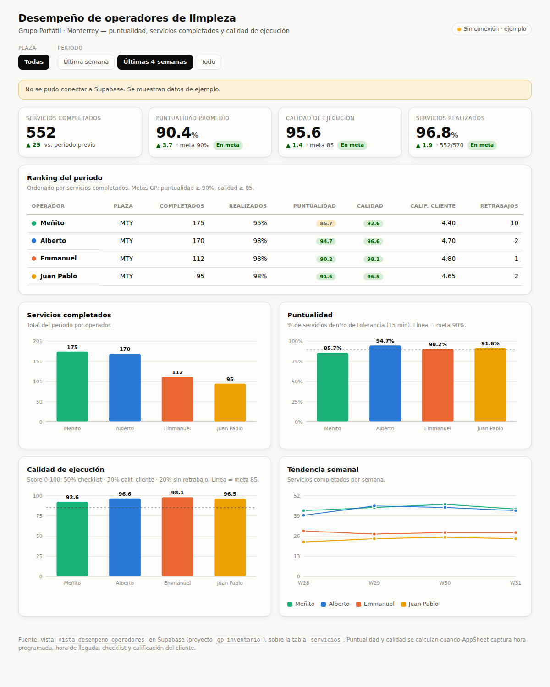

# Dashboard de desempeño de operadores de limpieza · Grupo Portátil

Dashboard **automatizado** para el seguimiento del desempeño de los operadores de campo
de Grupo Portátil. Lee en vivo desde Supabase (proyecto `gp-inventario`) y muestra
puntualidad, servicios completados y calidad de ejecución por operador y periodo, con
ranking, tendencia semanal y filtros.



> **Estado:** la vista `vista_desempeno_operadores` está **desplegada** (Fase 2 incluida) y el
> dashboard está **conectado**. La tabla `servicios` aún no tiene registros: en cuanto los
> operadores empiecen a capturar en AppSheet, el dashboard se puebla solo.

---

## OBJETIVO OPERATIVO

Dar a Eduardo una vista objetiva y sin captura manual del desempeño de los operadores
(Alberto, Emmanuel, Meñito, Juan Pablo), para decisiones de asignación de carga y evaluación.

## KPIs y cómo se calculan

El dashboard se construye sobre la tabla **real** `servicios` de `gp-inventario`.

| KPI | Estado | Cálculo | Meta |
|---|---|---|---|
| **Servicios completados** | ✅ Activo | `count(*) where completado` por operador/semana | volumen |
| **Puntualidad** | ✅ Activo (Fase 2) | % de servicios con llegada dentro de 15 min de la hora programada | ≥ 90% |
| **Calidad de ejecución** | ✅ Activo (Fase 2) | Score 0-100: 50% checklist + 30% calif. cliente + 20% sin retrabajo | ≥ 85 |
| **Servicios realizados** | ✅ Activo | completados / registrados | ≥ 95% |

Los campos que alimentan puntualidad y calidad (`hora_programada`, `hora_llegada`,
`checklist_ok/total`, `calificacion_cliente`, `retrabajo`) ya existen en `servicios` (Fase 2
aplicada). Mientras un servicio no traiga esos datos, la vista devuelve `puntualidad_pct` /
`calidad_score` en NULL y el dashboard los muestra como **"sin captura"** — no penaliza.
Los porcentajes se reagregan desde sumas crudas al cambiar de periodo (no se promedian %).

## Arquitectura

```
Operador (AppSheet / SimpliRoute, campo)
   └─ registra servicio (completado, foto, checkout)
        ▼
Supabase · tabla servicios            ← fuente de verdad (ya existente)
        │  vista_desempeno_operadores (agregado por operador/semana)
        ├──────────────► Dashboard index.html  (lectura en vivo con anon key)
        └──────────────► Reporte semanal WhatsApp  [n8n]  (misma vista)
```

## Contenido

```
dashboard-desempeno-operadores/
├── index.html                          # Dashboard (conectado a gp-inventario)
├── sql/
│   ├── vista_desempeno_operadores.sql  # Vista base (servicios completados)
│   └── fase2-puntualidad-calidad.sql   # Fase 2 aplicada (puntualidad + calidad)
├── automatizacion/
│   └── n8n-flujo.md                    # Reporte semanal + alertas
└── docs/preview.png
```

## Puesta en marcha

La vista ya está creada y el dashboard ya trae URL + anon key del proyecto. Para verlo:

1. Abrir `index.html` en el navegador (o publicarlo en Supabase Storage / Vercel / Netlify).
2. Con la tabla `servicios` vacía, muestra datos de **ejemplo** con un aviso; cuando haya
   servicios reales, cambia automáticamente a **"Supabase · en vivo"**.

### Nota de seguridad

La vista se expone con la `anon key` (pública, embebida en el HTML) y solo devuelve
**conteos agregados** por operador y semana — sin datos de cliente. Si el dashboard se
publica en una URL abierta y se prefiere no exponer ni esos conteos, hospedarlo detrás de
autenticación (Supabase Auth o el hosting) y revocar el `grant ... to anon`.

## Fase 2 — puntualidad y calidad (aplicada)

El esquema de Fase 2 ya está desplegado (`sql/fase2-puntualidad-calidad.sql`): las columnas
de captura existen en `servicios` y la vista entrega `puntualidad_pct` y `calidad_score`.
Falta el paso operativo para poblarlas:

1. Configurar en AppSheet la captura de: **hora programada**, **check-in** (hora de llegada),
   **checklist** (ok/total), **calificación del cliente** y bandera de **retrabajo**.
2. (Opcional) mapear la hora de check-out existente (`checkout_time`) si se decide usarla
   como hora de llegada en vez de un campo nuevo.

En cuanto AppSheet escriba esos campos, los KPIs de puntualidad y calidad dejan de mostrar
"sin captura" y aparecen automáticamente en el dashboard y en el reporte semanal.

## SIGUIENTE ACCIÓN

Publicar `index.html` donde el equipo lo consulte, y configurar en AppSheet la captura de los
campos de Fase 2 para activar puntualidad y calidad con datos reales.
