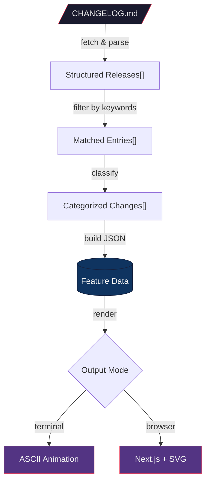
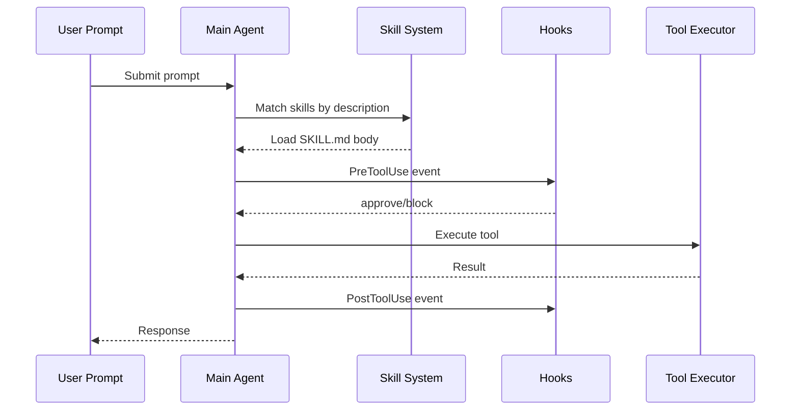

# Deterministic Visual Rendering

Render deterministic process specifications as animated ASCII diagrams in the terminal, combining beautiful-mermaid rendering with Ghostty-style frame animation.

## Core Concept

Transform mermaid diagram definitions into two output modes:

1. **Terminal (ASCII Animation)**: Ghostty-style frame-by-frame ASCII art with ANSI 256-color, rendered at configurable FPS (up to 60fps) using cursor repositioning
2. **Web (Next.js + SVG)**: beautiful-mermaid SVG rendering with CSS/SMIL animation, served via Next.js app

## When to Use

- Visualizing deterministic process flows (changelog filtering, data pipelines, agent workflows)
- Rendering architecture diagrams in the terminal without leaving the CLI
- Creating animated walkthroughs of multi-step processes
- Producing reusable mermaid-based visualizations that work in both terminal and browser

## Process

### Step 1: Extract Mermaid from Process Specification

Parse the deterministic process document and extract or generate mermaid diagram definitions:

- **Flowcharts** (`graph TD`) for step-by-step processes
- **Sequence diagrams** (`sequenceDiagram`) for agent/tool interactions
- **State diagrams** (`stateDiagram-v2`) for lifecycle workflows
- **Architecture diagrams** (`graph LR`) for component relationships

### Step 2: Choose Rendering Mode

| Mode | Engine | Output | Use Case |
|------|--------|--------|----------|
| `ascii-static` | beautiful-mermaid `renderMermaidAscii()` | Single ASCII frame | Quick inline display |
| `ascii-animate` | Ghostty frame engine | Animated terminal frames | Progressive reveal, demos |
| `web-svg` | beautiful-mermaid `renderMermaid()` | Next.js app with SVG | Browser-based interactive view |
| `web-ascii` | beautiful-mermaid ASCII + Next.js | ASCII art in browser | Retro web aesthetic |

### Step 3: Configure Theme

Use beautiful-mermaid's theme system with two foundational colors:

- **bg** (background): Terminal background or page color
- **fg** (foreground): Primary text and line color

Enriched mode overrides: `line`, `accent`, `muted`, `surface`, `border`

Built-in themes: `vercel-dark`, `vercel-light`, `github-dark`, `github-light`, `dracula`, `nord`, `solarized-dark`, `solarized-light`, `monokai`, `one-dark`, `catppuccin-mocha`, `catppuccin-latte`, `rose-pine`, `rose-pine-dawn`, `tokyo-night`, `gruvbox-dark`

For terminal ASCII, map theme colors to ANSI 256-color palette.

### Step 4: Generate Frames (Animation Mode)

The Ghostty-style animation engine produces frames by:

1. **Parsing** the mermaid diagram into a node/edge graph
2. **Ordering** elements by rank (topological sort for flowcharts, time for sequences)
3. **Generating frames**: Each frame adds one element (node or edge) to the ASCII canvas
4. **Applying color**: ANSI escape codes for foreground, background, bold, dim
5. **Rendering**: Write frames to terminal using `\033[H` (cursor home) for flicker-free updates

Frame generation strategies:
- `progressive`: Nodes/edges appear rank-by-rank (default)
- `typewriter`: Characters appear left-to-right, top-to-bottom
- `pulse`: All elements visible, colors pulse through a cycle
- `flow`: Animated particles travel along edges

### Step 5: Render

Execute the rendering script:

```bash
# Static ASCII
./scripts/render.sh --mode ascii-static --input diagram.mmd --theme vercel-dark

# Animated ASCII (Ghostty-style)
./scripts/render.sh --mode ascii-animate --input diagram.mmd --theme dracula --fps 30 --strategy progressive

# Web SVG (launches Next.js dev server)
./scripts/render.sh --mode web-svg --input diagram.mmd --theme github-dark --port 3000
```

## Mermaid Patterns for Deterministic Processes

### Changelog Feature Filter Flow



### Agent Skill Lifecycle



## Box-Drawing Character Set

For ASCII rendering, use Unicode box-drawing characters for crisp terminal output:

```
Corners: ┌ ┐ └ ┘ ╭ ╮ ╰ ╯
Lines:   ─ │ ═ ║
Tees:    ├ ┤ ┬ ┴ ┼
Arrows:  → ← ↑ ↓ ⟶ ⟵ ▶ ◀ ▲ ▼
Blocks:  █ ▓ ▒ ░ ▄ ▀ ▌ ▐
Dots:    ● ○ ◆ ◇ ■ □
Curved:  ╭─╮ ╰─╯ (rounded corners)
```

## ANSI Color Reference

```
\033[38;5;{n}m  - Set foreground (256-color)
\033[48;5;{n}m  - Set background (256-color)
\033[1m         - Bold
\033[2m         - Dim
\033[0m         - Reset
\033[H          - Cursor home (for frame replacement)
\033[2J         - Clear screen
\033[?25l       - Hide cursor
\033[?25h       - Show cursor
```

## Quality Checklist

- [ ] Mermaid syntax validates (no parse errors)
- [ ] ASCII output fits within 120-column terminal width
- [ ] Color theme applies consistently across all nodes/edges
- [ ] Animation frames transition without flicker
- [ ] Progressive reveal follows topological order
- [ ] Box-drawing characters align correctly (no gaps)
- [ ] ANSI reset codes prevent color bleed
- [ ] Web SVG matches terminal ASCII in structure
- [ ] Theme colors map correctly between SVG and ANSI
- [ ] Script exits cleanly (cursor restored, colors reset)
