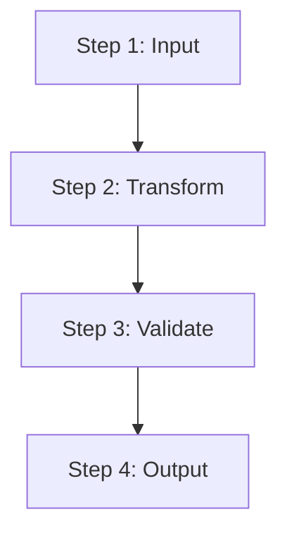
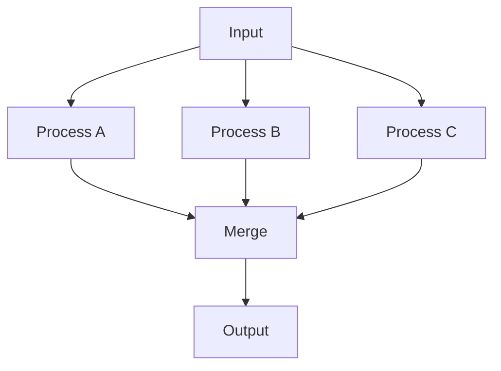
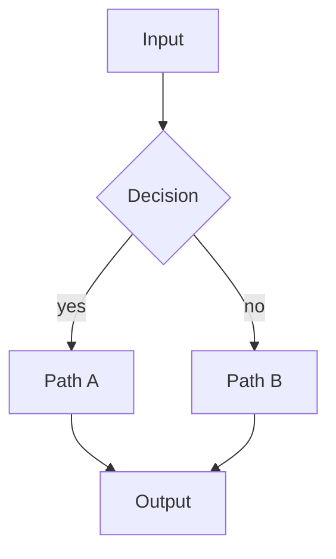
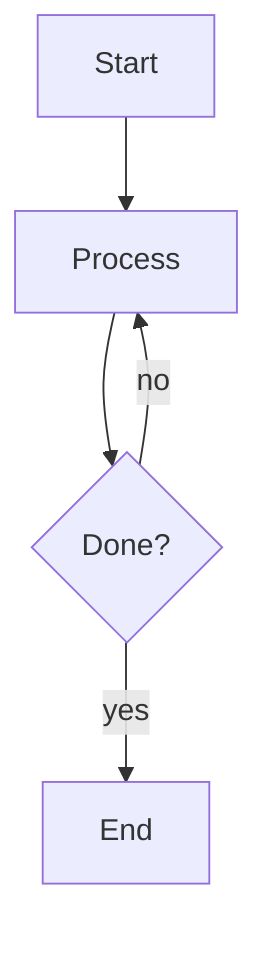
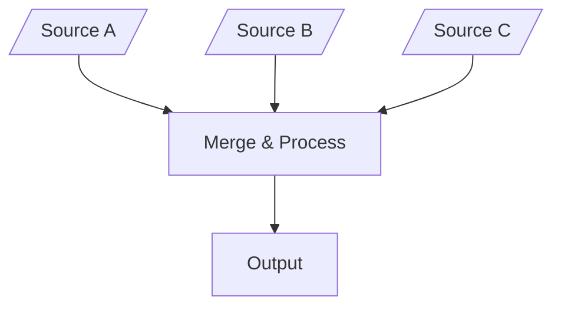
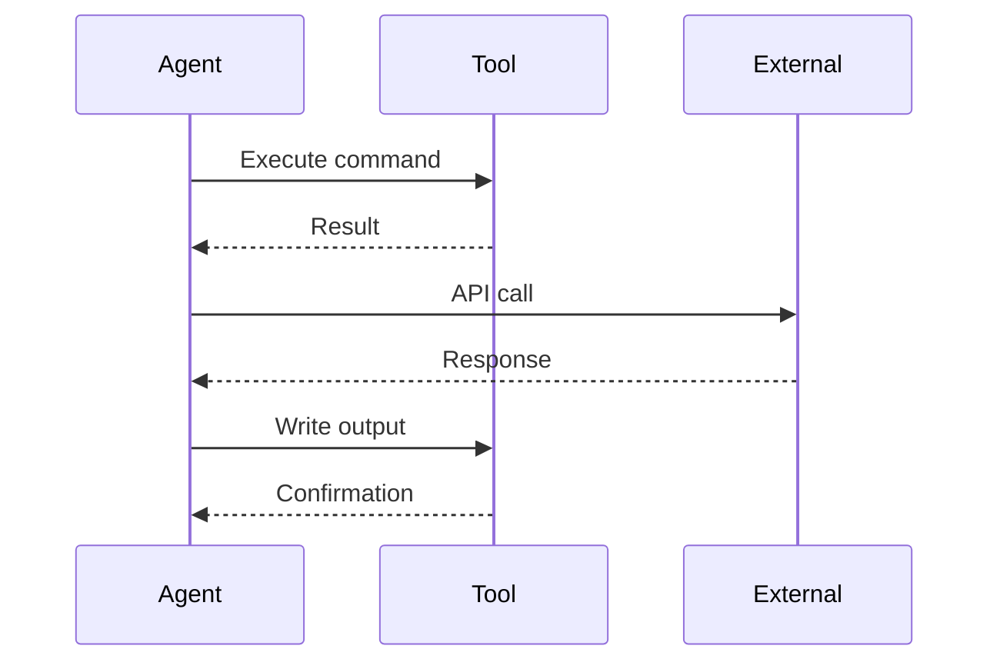
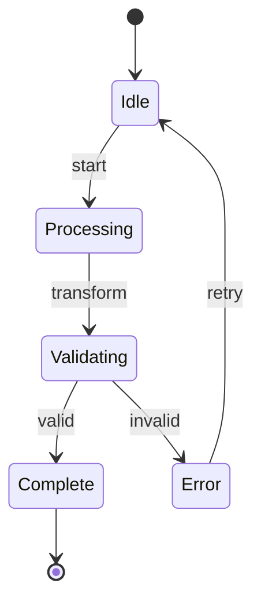
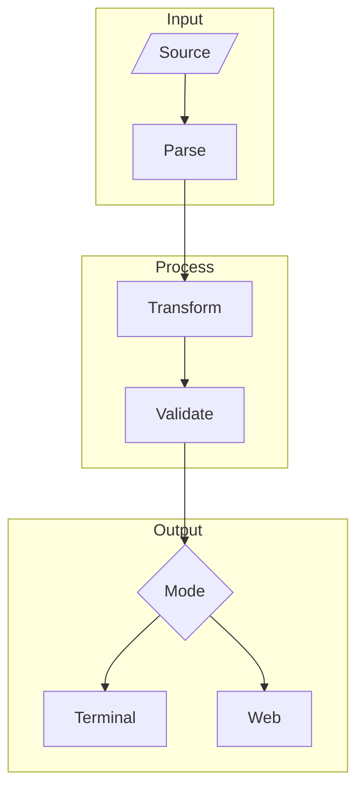

# Mermaid Patterns for Deterministic Processes

## Pattern Library

This reference provides reusable mermaid diagram patterns for common deterministic process structures.

## 1. Linear Pipeline

For processes with sequential steps and no branching:



ASCII representation:
```
╭──────────────────╮
│  Step 1: Input   │
╰────────┬─────────╯
         │
         ▼
╭──────────────────╮
│ Step 2: Transform│
╰────────┬─────────╯
         │
         ▼
╭──────────────────╮
│ Step 3: Validate │
╰────────┬─────────╯
         │
         ▼
╭──────────────────╮
│  Step 4: Output  │
╰──────────────────╯
```

## 2. Fan-Out / Fan-In

For parallel processing with merge:



## 3. Decision Branch

For conditional logic:



## 4. Iterative Loop

For processes that repeat:



## 5. Multi-Input Merge

For processes with multiple input sources:



## 6. Agent Interaction (Sequence)

For agent-to-agent or agent-to-tool communication:



## 7. State Machine

For lifecycle or state-based processes:



## 8. Changelog Feature Filter (Complete)

The full deterministic process from `000-claude-filter-changelog-feature-to-html-prompt.md`:

```mermaid
graph TD
    URL[/"CHANGELOG URL"/] -->|fetch| RAW["Raw Markdown"]
    FEAT[/"Feature Name"/] --> KW["Keyword Set"]
    CATS[/"Category Defs"/] --> CLASS["Classifier"]

    RAW -->|parse semver sections| REL["Release[]"]
    REL -->|scan entries| SCAN["Entry Scanner"]
    KW --> SCAN
    SCAN -->|filter matches| MATCH["MatchedEntry[]"]
    MATCH --> CLASS

    CLASS --> JSON["Feature JSON"]
    JSON --> RENDER{Render Mode}

    RENDER -->|ascii-animate| TERM["Terminal Frames"]
    RENDER -->|ascii-static| STATIC["Single Frame"]
    RENDER -->|web-svg| WEB["Next.js App"]

    TERM --> QC["Quality Checklist"]
    STATIC --> QC
    WEB --> QC

    style URL fill:#1a1a2e,stroke:#e94560
    style FEAT fill:#1a1a2e,stroke:#0070f3
    style CATS fill:#1a1a2e,stroke:#16213e
    style JSON fill:#0f3460,stroke:#16213e
    style QC fill:#533483,stroke:#e94560
```



## Naming Conventions

### Node IDs
- Use short, descriptive camelCase: `fetchData`, `parseResult`, `validateOutput`
- For inputs: prefix with `I` or use special shapes (`[/"..."/]`)
- For outputs: suffix with `Out` or use special shapes

### Edge Labels
- Keep under 20 characters
- Use verb phrases: `|fetch & parse|`, `|filter by|`, `|validate|`
- For conditions: `|yes|`, `|no|`, `|error|`, `|success|`

### Style Classes
- Use `style` directives for color-coded categorization
- Map colors to the active theme's nodeColors palette
- Keep consistent across related diagrams

## Composability

Diagrams can reference sub-processes by using subgraph:



This enables the deterministic process specification to break complex workflows into composable visual units.
