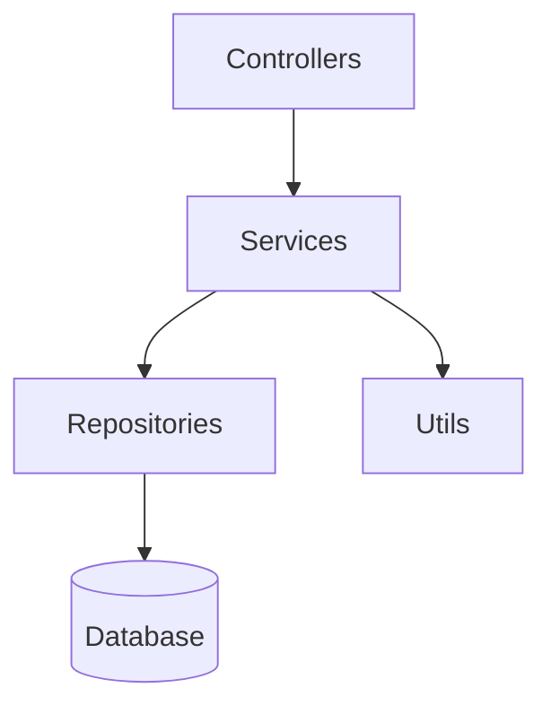

# Explain Architecture Plugin

Scan a repository and generate a visual architecture diagram from import relationships between modules.

## Overview

The Explain Architecture plugin analyzes a codebase by parsing import statements across source files, building a dependency graph, and generating a diagram that shows how modules interact. It abstracts individual files into logical groups based on folder structure, giving a high-level view of the project's architecture.

Supports TypeScript, JavaScript, Python, and Go projects.

## Commands

### `/explain-architecture`

Scans the repository and outputs an architecture diagram.

**What it does:**
1. Resolves the target directory (current dir or provided path)
2. Recursively finds source files (`.ts`, `.js`, `.py`, `.go`, etc.), excluding noise folders
3. Parses import statements to extract file-to-file dependencies
4. Groups files by top-level subfolder to form modules
5. Builds a module-level dependency graph and detects cycles
6. Generates a diagram in the requested format
7. Prints to terminal or writes to a file

**Usage:**
```bash
/explain-architecture
/explain-architecture src
/explain-architecture --format plantuml
/explain-architecture --output architecture.md
/explain-architecture src --depth 3 --include-external --preview
```

**Options:**

| Flag | Description | Default |
|------|-------------|---------|
| `[path]` | Directory to scan | Current directory |
| `--format` | Output format: `mermaid`, `plantuml`, `json` | `mermaid` |
| `--output <file>` | Write result to a file | Print to terminal |
| `--depth <N>` | Limit graph to N hops from root modules | Unlimited |
| `--include-external` | Show third-party packages as nodes | Hidden |
| `--preview` | Print to terminal even when `--output` is set | Off |

## Example output



## Supported languages

| Language | Extensions | Import syntax |
|----------|-----------|---------------|
| TypeScript | `.ts`, `.tsx`, `.mts` | `import`, `export … from`, `require`, `import()` |
| JavaScript | `.js`, `.jsx`, `.mjs` | same as TypeScript |
| Python | `.py` | `import`, `from … import` |
| Go | `.go` | `import "…"`, `import (…)` |
