# Entity Sequence Diagrams

Seven sequence diagrams — one from each entity's perspective — showing every
interaction in the Neon + Vercel database-per-branch system.

---

## 1. Developer Perspective

What the developer sees and does across the full lifecycle.

```mermaid
sequenceDiagram
    actor Dev as Developer
    participant Git as Git Branch
    participant PR as Pull Request
    participant GHA as GitHub Actions
    participant Neon as Neon Postgres
    participant Vercel as Vercel
    participant E2E as E2E Tests

    Note over Dev: ── Feature Development ──

    Dev->>Git: git checkout -b feat/user-auth
    Dev->>Git: git push origin feat/user-auth
    Dev->>PR: Open PR #42 (feat/user-auth → main)

    Note over Dev: ── Automated Pipeline ──

    PR-->>GHA: triggers preview workflow
    GHA-->>Neon: create branch preview/pr-42
    Neon-->>GHA: db_url, db_url_pooled
    GHA-->>Vercel: build + deploy preview
    GHA-->>PR: 💬 comment: preview URL + branch ID
    Vercel-->>GHA: repository_dispatch (deploy success)
    GHA-->>E2E: run Playwright against preview URL
    E2E-->>PR: ✅ test results

    Note over Dev: ── Iterate ──

    Dev->>Git: git push (new commits)
    Git-->>PR: synchronize event
    PR-->>GHA: re-triggers preview workflow
    GHA-->>Vercel: rebuild preview (same Neon branch)

    Note over Dev: ── Schema Diff Review ──

    GHA-->>Neon: compare preview/pr-42 vs main
    GHA-->>PR: 💬 comment: schema diff

    Note over Dev: ── Merge & Cleanup ──

    Dev->>PR: Merge PR #42
    PR-->>GHA: closed event
    GHA-->>Neon: delete preview/pr-42
    PR-->>GHA: push to main event
    GHA-->>Neon: reset dev branch
    GHA-->>Vercel: deploy production
```

---

## 2. Git Branch Perspective

How Git branches map to system actions.

```mermaid
sequenceDiagram
    participant Dev as Developer
    participant Git as Git Branch
    participant PR as Pull Request
    participant GHA as GitHub Actions
    participant Neon as Neon Postgres
    participant Vercel as Vercel

    Note over Git: ── Branch Creation ──

    Dev->>Git: git checkout -b feat/x
    Dev->>Git: git push origin feat/x

    Note over Git: ── PR Binding ──

    Dev->>PR: Open PR (feat/x → main)
    Git-->>PR: head_branch = feat/x

    Note over Git: ── Mapped to Neon ──

    rect rgb(240, 248, 255)
        Note right of Git: Git → Neon Branch Mapping
        Git->>GHA: PR opened on feat/x
        GHA->>Neon: create preview/pr-N
        Note over Neon: Inherits main schema + data
    end

    Note over Git: ── Push = Rebuild ──

    Dev->>Git: git push (amend/new commits)
    Git-->>PR: synchronize
    PR-->>GHA: rebuild with existing Neon branch

    Note over Git: ── Merge to main ──

    Dev->>Git: git merge feat/x into main
    Git-->>GHA: push event on main

    rect rgb(255, 248, 240)
        Note right of Git: main push effects
        GHA->>Neon: reset dev branch from main
        GHA->>Vercel: deploy production
    end

    Note over Git: ── Cleanup ──

    Git-->>PR: PR closed
    PR-->>GHA: delete Neon branch
```

---

## 3. Pull Request Perspective

The PR as the central orchestrator of the branching lifecycle.

```mermaid
sequenceDiagram
    participant Dev as Developer
    participant PR as Pull Request
    participant W1 as Preview Workflow
    participant W2 as Cleanup Workflow
    participant W3 as E2E Workflow
    participant Neon as Neon Postgres
    participant Vercel as Vercel

    Note over PR: state = OPENED

    Dev->>PR: Open PR #42
    PR->>W1: trigger (opened)

    rect rgb(240, 255, 240)
        Note over W1: Preview Pipeline
        W1->>Neon: create preview/pr-42
        Neon-->>W1: db_url, branch_id
        W1->>Neon: schema diff vs main
        W1-->>PR: 💬 schema diff comment
        W1->>Vercel: build (DATABASE_URL injected)
        Vercel-->>W1: deploy URL
        W1-->>PR: 💬 preview URL comment
    end

    Vercel-->>W3: repository_dispatch
    W3->>W3: Playwright tests
    W3-->>PR: ✅ pass / ❌ fail

    Note over PR: state = SYNCHRONIZE

    Dev->>PR: Push new commits
    PR->>W1: trigger (synchronize)
    Note over W1: Cancel previous run
    W1->>Neon: reuse preview/pr-42
    W1->>Vercel: rebuild preview
    W1-->>PR: 💬 update preview comment

    Note over PR: state = CLOSED (merged)

    Dev->>PR: Merge PR
    PR->>W2: trigger (closed)

    rect rgb(255, 240, 240)
        Note over W2: Cleanup Pipeline
        W2->>Neon: delete preview/pr-42
        Note over Vercel: Auto-deactivate preview
    end
```

---

## 4. Neon Branch Perspective

Lifecycle of a Neon database branch from creation to deletion.

---

## 5. GitHub Workflow Perspective

The four workflows and their job orchestration.

```mermaid
sequenceDiagram
    participant Trigger as Event Trigger
    participant W1 as Preview Workflow
    participant W2 as Cleanup Workflow
    participant W3 as Production Workflow
    participant W4 as E2E Workflow
    participant Neon as Neon API
    participant Vercel as Vercel CLI
    participant PR as Pull Request

    Note over Trigger: ── PR Events ──

    Trigger->>W1: pull_request [opened, synchronize, reopened]
    Note over W1: concurrency: preview-{PR#}<br/>cancel-in-progress: true

    rect rgb(240, 248, 255)
        W1->>W1: Job 1: neon-branch
        W1->>Neon: create-branch-action@v5
        Neon-->>W1: db_url, db_url_pooled, branch_id

        W1->>W1: Job 2: schema-diff (needs: neon-branch)
        W1->>Neon: schema-diff-action@v1
        W1-->>PR: comment with diff

        W1->>W1: Job 3: vercel-preview (needs: neon-branch)
        W1->>Vercel: pull → build → deploy
        Vercel-->>W1: preview URL
        W1-->>PR: comment with URL
    end

    Note over Trigger: ── PR Close ──

    Trigger->>W2: pull_request [closed]

    rect rgb(255, 240, 240)
        W2->>W2: Job: delete-neon-branch
        W2->>Neon: delete-branch-action@v3
    end

    Note over Trigger: ── Push to main ──

    Trigger->>W3: push [main]
    Note over W3: concurrency: production<br/>cancel-in-progress: false

    rect rgb(240, 255, 240)
        W3->>W3: Job 1: neon-reset (continue-on-error)
        W3->>Neon: reset-branch-action@v1 (dev)

        W3->>W3: Job 2: vercel-production
        W3->>Vercel: pull → build --prod → deploy --prod
    end

    Note over Trigger: ── Deploy Success ──

    Trigger->>W4: repository_dispatch [vercel.deployment.success]

    rect rgb(255, 255, 240)
        W4->>W4: npm ci + playwright install
        W4->>W4: playwright test (BASE_URL from payload)
        W4->>W4: upload artifacts
    end
```

---

## 6. Vercel Deploy Perspective

Vercel's view: receiving builds, serving previews, dispatching events.

---

## 7. Database Schema Perspective

How schema changes flow through the system.

```mermaid
sequenceDiagram
    participant Dev as Developer
    participant Git as Migration Files
    participant Neon as Neon Branch
    participant Main as Main Schema
    participant Preview as Preview Schema
    participant Diff as Schema Diff Action
    participant PR as Pull Request
    participant MCP as Neon MCP Server

    Note over Main: ── Baseline Schema ──

    Main->>Main: Production schema (source of truth)
    Note over Main: tables, columns, indexes,<br/>constraints, functions

    Note over Preview: ── Branch Fork ──

    Neon->>Preview: copy-on-write from Main
    Note over Preview: Identical schema at creation

    Note over Dev: ── Schema Change ──

    Dev->>Git: Add migration file
    Note over Git: e.g. drizzle/0001_add_users.sql<br/>CREATE TABLE users (...)

    Git->>Neon: Migration applied at build time
    Neon->>Preview: ALTER TABLE / CREATE TABLE
    Note over Preview: Schema now diverges from Main

    Note over Diff: ── Schema Comparison ──

    Diff->>Main: describe tables
    Main-->>Diff: table definitions (production)
    Diff->>Preview: describe tables
    Preview-->>Diff: table definitions (preview)

    rect rgb(255, 255, 240)
        Note over Diff: Compute diff
        Diff->>Diff: Added tables
        Diff->>Diff: Removed tables
        Diff->>Diff: Modified columns
        Diff->>Diff: New indexes
        Diff->>Diff: Changed constraints
    end

    Diff-->>PR: 💬 Schema diff comment

    Note over Dev: ── MCP Introspection ──

    Dev->>MCP: "show me the users table schema"
    MCP->>Preview: describe_table_schema(users)
    Preview-->>MCP: column names, types, constraints
    MCP-->>Dev: formatted table definition

    Dev->>MCP: "run SELECT * FROM users LIMIT 5"
    MCP->>Preview: run_sql(query)
    Preview-->>MCP: query results
    MCP-->>Dev: formatted results

    Note over Main: ── Merge: Schema Promotion ──

    Dev->>Git: Merge PR into main
    Git->>Main: Apply same migration
    Note over Main: Schema now matches Preview
    Note over Preview: Branch deleted
```

