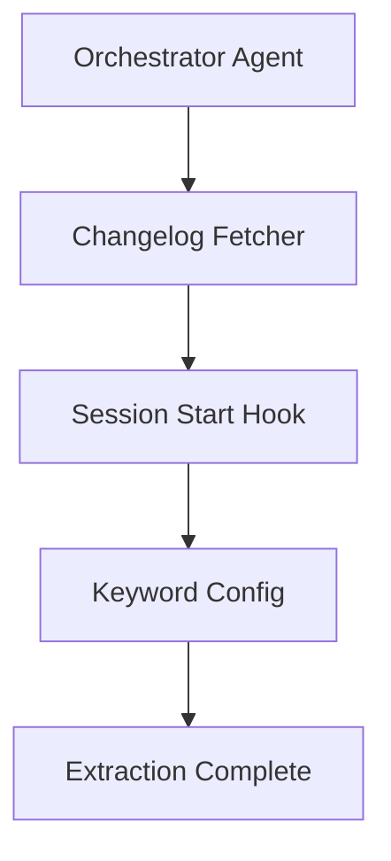

# Animated Workflow Visualization

Render animated Mermaid diagrams in the terminal with color and progressive
reveal — inspired by Ghostty's 60fps ASCII art and powered by
`@vercel/beautiful-mermaid`.

## When to Use This Skill

Activate this skill when:

1. **Starting a new branch** — render the branch creation workflow as an
   animated diagram showing all phases before work begins
2. **Running a deterministic extraction** — show the extraction pipeline
   (CHANGELOG → JSONL → HTML) with live progress coloring
3. **Visualizing any multi-phase process** — any mermaid diagram can be
   rendered with animation in the terminal
4. **Reviewing workflow state** — re-render diagrams with completed phases
   highlighted vs pending phases dimmed

## Quick Start

```bash
# Install dependencies (first time only)
cd skills/animated-workflow-viz && npm install

# Render the branch creation workflow
node skills/animated-workflow-viz/scripts/render-workflow.mjs \
  --template branch-create

# Render the extraction pipeline
node skills/animated-workflow-viz/scripts/render-workflow.mjs \
  --template extraction-pipeline

# Render any .mmd file with animation
node skills/animated-workflow-viz/scripts/render-workflow.mjs \
  --file path/to/diagram.mmd

# Static render (no animation)
node skills/animated-workflow-viz/scripts/render-workflow.mjs \
  --template branch-create --static

# Custom theme
node skills/animated-workflow-viz/scripts/render-workflow.mjs \
  --template branch-create --theme tokyo-night
```

## How It Works

### Architecture

```
┌─────────────────────┐     ┌──────────────────────┐     ┌─────────────────┐
│  Mermaid Source      │────▶│  beautiful-mermaid    │────▶│  ANSI Animator  │
│  (.mmd templates)    │     │  parseMermaid()       │     │  (ghostty-style)│
│                      │     │  renderMermaidAscii() │     │                 │
└─────────────────────┘     └──────────────────────┘     └────────┬────────┘
                                                                   │
                                                          ┌────────▼────────┐
                                                          │  Terminal Output │
                                                          │  - Truecolor    │
                                                          │  - Sync output  │
                                                          │  - Progressive  │
                                                          │    reveal       │
                                                          └─────────────────┘
```

### Pipeline Steps

1. **Parse** — `parseMermaid()` extracts the graph structure (nodes, edges,
   subgraphs) from mermaid source text
2. **Layout** — `renderMermaidAscii()` produces box-drawing character output
   with proper node sizing and edge routing
3. **Colorize** — The ANSI colorizer maps node IDs to category colors using
   the 5-color system (Blue=Agents, Green=Tools, Orange=Hooks, Purple=Params,
   Pink=Events) and injects ANSI truecolor escape codes
4. **Animate** — The frame animator progressively reveals nodes and edges
   using ghostty-style techniques:
   - Synchronized output (`\x1b[?2026h/l`) for atomic frame updates
   - Cursor home (`\x1b[H`) for in-place redraw
   - Hidden cursor during animation
   - Configurable FPS (default: 24fps, matching Ghostty website)

### Color System

The 5-color category system from `deterministic-object-usage/` is preserved:

| Category | Hex       | ANSI Truecolor              | Usage              |
|----------|-----------|-----------------------------|--------------------|
| Agent    | `#58a6ff` | `\x1b[38;2;88;166;255m`    | Agent nodes        |
| Tool     | `#3fb950` | `\x1b[38;2;63;185;80m`     | Tool nodes         |
| Hook     | `#d29922` | `\x1b[38;2;210;153;34m`    | Hook nodes         |
| Param    | `#bc8cff` | `\x1b[38;2;188;140;255m`   | Config/param nodes |
| Event    | `#f778ba` | `\x1b[38;2;247;120;186m`   | Event nodes        |
| Default  | `#8b949e` | `\x1b[38;2;139;148;158m`   | Uncategorized      |
| Dim      | `#484f58` | `\x1b[38;2;72;79;88m`      | Pending/inactive   |
| Bright   | `#f0f6fc` | `\x1b[38;2;240;246;252m`   | Highlights         |

### Provided Templates

| Template              | File                           | Description                    |
|-----------------------|--------------------------------|--------------------------------|
| `branch-create`      | `branch-create-workflow.mmd`   | 8-phase branch creation flow   |
| `extraction-pipeline` | `extraction-pipeline.mmd`     | CHANGELOG → JSONL → HTML flow  |
| `neon-vercel-cicd`   | `neon-vercel-cicd.mmd`         | Neon + Vercel CI/CD pipeline   |

### Creating Custom Templates

Any valid mermaid flowchart can be rendered. To integrate with the color
system, prefix node IDs with a category:



Node ID prefixes (`agent_`, `tool_`, `hook_`, `param_`, `event_`) are
automatically detected and mapped to category colors.

## Integration with Deterministic Process

When starting a new extraction:

1. Claude reads `BRANCH_CREATE_TEMPLATE.md` for the checklist
2. Claude runs this skill to render the workflow as an animated diagram
3. As phases complete, Claude can re-render with `--completed` flags to
   show progress visually
4. The same diagram format can be embedded in PR descriptions as static
   mermaid (GitHub renders it natively)

## Configuration

Environment variables:

| Variable                | Default | Description                         |
|-------------------------|---------|-------------------------------------|
| `WORKFLOW_VIZ_FPS`      | `24`    | Animation frames per second         |
| `WORKFLOW_VIZ_THEME`    | `dark`  | Color theme name                    |
| `WORKFLOW_VIZ_STATIC`   | `0`     | Set to `1` to disable animation     |
| `WORKFLOW_VIZ_ASCII`    | `0`     | Set to `1` for pure ASCII (no Unicode) |
| `NO_COLOR`              | —       | Disables all color output           |
| `TERM`                  | —       | Used for terminal capability detection |
