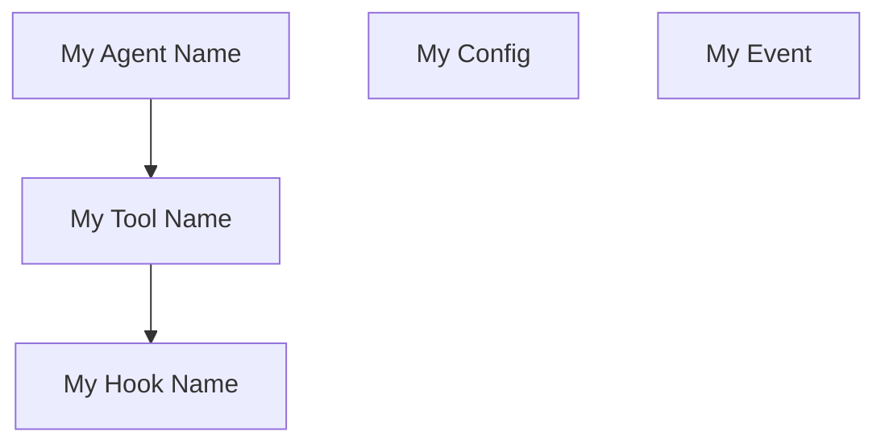

# Technical Reference — Animated Workflow Visualization

## Architecture

```
┌──────────────────┐    ┌──────────────────────┐    ┌──────────────────┐
│ Mermaid Templates │───▶│ @vercel/beautiful-   │───▶│ ANSI Animator    │
│ (.mmd files)      │    │ mermaid              │    │ (ghostty-style)  │
│                   │    │ - parseMermaid()      │    │ - Truecolor      │
│ - branch-create   │    │ - renderMermaidAscii()│    │ - Sync output    │
│ - extraction-pipe │    │                      │    │ - Progressive    │
│ - custom diagrams │    │ ASCII box-drawing    │    │   reveal frames  │
└──────────────────┘    └──────────────────────┘    └────────┬─────────┘
                                                              │
                        ┌──────────────────────┐    ┌────────▼─────────┐
                        │ Category Detector     │───▶│ Colorized Output │
                        │ - ID prefix matching  │    │ - Per-node color │
                        │ - Keyword heuristics  │    │ - Phase progress │
                        │ - Explicit overrides  │    │ - Status states  │
                        └──────────────────────┘    └──────────────────┘
```

## Module Reference

### `ansi-animator.mjs`

The terminal animation engine, modeled after Ghostty's approach.

| Export | Type | Description |
|--------|------|-------------|
| `ANSI` | Object | ANSI escape code constants (cursor, color, sync) |
| `CATEGORY_COLORS` | Object | 5-color category system {hex, rgb, label} |
| `UI_COLORS` | Object | UI state colors (dim, bright, border, etc.) |
| `detectCapabilities()` | Function | Detect terminal truecolor/sync/unicode support |
| `colorize(text, category, opts)` | Function | Apply ANSI color by category name |
| `animateFrames(frames, opts)` | Function | Play frame sequence with sync output |
| `generateRevealFrames(final, opts)` | Function | Generate progressive reveal frames |
| `renderProgressBar(current, total, labels)` | Function | Phase progress bar |
| `renderBox(text, opts)` | Function | Box-drawing character border |
| `renderLegend(opts)` | Function | Category color legend |
| `stripAnsi(str)` | Function | Remove ANSI codes from string |

### `mermaid-to-ansi.mjs`

Bridge between beautiful-mermaid ASCII output and ANSI color injection.

| Export | Type | Description |
|--------|------|-------------|
| `detectCategory(nodeId, label, map)` | Function | Map node to category via prefix/keyword |
| `extractNodes(mermaidSource, map)` | Function | Parse nodes and detect categories |
| `colorizeAscii(ascii, nodeMap, opts)` | Function | Inject ANSI color into ASCII diagram |
| `renderColorizedMermaid(source, opts)` | Function | Full pipeline: mermaid → colored ASCII |

### `render-workflow.mjs`

CLI entry point.

| Flag | Env Var | Default | Description |
|------|---------|---------|-------------|
| `--template` | — | `branch-create` | Built-in template name |
| `--file` | — | — | Path to custom .mmd file |
| `--inline` | — | — | Inline mermaid source string |
| `--theme` | `WORKFLOW_VIZ_THEME` | `dark` | Color theme |
| `--static` | `WORKFLOW_VIZ_STATIC` | `false` | Disable animation |
| `--fps` | `WORKFLOW_VIZ_FPS` | `24` | Animation frames per second |
| `--ascii` | `WORKFLOW_VIZ_ASCII` | `false` | Pure ASCII mode |
| `--completed` | — | `[]` | Completed phase IDs |
| `--active` | — | — | Active phase ID |
| `--style` | — | `top-down` | Animation: top-down, fade-in, left-right |
| `--compact` | — | `false` | Faster reveal |

## Animation Techniques

### Synchronized Output (DEC Mode 2026)

The key to flicker-free terminal animation. Each frame is wrapped:

```
\x1b[?2026h   ← suppress rendering
... frame content ...
\x1b[?2026l   ← atomic render
```

**Supported terminals**: Ghostty, Kitty, WezTerm, iTerm2, Alacritty 0.13+

### Progressive Reveal

Three animation styles for progressively showing diagram content:

1. **top-down** (default) — Lines appear from top to bottom with dimmed preview
2. **fade-in** — All content visible, transitions from dim → full color
3. **left-right** — Columns reveal from left to right

### Frame Timing

Target 24 FPS (matching Ghostty website animation). Each frame:
1. Cursor home (`\x1b[H`)
2. Write full frame with ANSI codes
3. Sleep for `1000/fps` ms minus render time

## Color System

### Category Colors (from deterministic-object-usage)

| Category | Hex | RGB | ANSI |
|----------|-----|-----|------|
| Agent | `#58a6ff` | `88,166,255` | `\x1b[38;2;88;166;255m` |
| Tool | `#3fb950` | `63,185,80` | `\x1b[38;2;63;185;80m` |
| Hook | `#d29922` | `210,153,34` | `\x1b[38;2;210;153;34m` |
| Param | `#bc8cff` | `188,140,255` | `\x1b[38;2;188;140;255m` |
| Event | `#f778ba` | `247,120,186` | `\x1b[38;2;247;120;186m` |

### Node Category Detection

Nodes are mapped to categories by (in priority order):

1. **Explicit map** — `{ nodeId: 'category' }` passed as option
2. **ID prefix** — `agent_*`, `tool_*`, `hook_*`, `param_*`, `event_*`
3. **Keyword matching** — Node ID or label contains category keywords

### Progress States

When `--completed` and `--active` flags are used:
- **Completed nodes** → bold green
- **Active node** → bold, original category color
- **Pending nodes** → dimmed

## Theme Integration with beautiful-mermaid

Each theme includes a `beautiful_mermaid` key that maps to
`@vercel/beautiful-mermaid`'s `DiagramColors` interface:

```javascript
import { renderMermaid, THEMES } from '@vercel/beautiful-mermaid';
import themes from '../assets/themes.json' assert { type: 'json' };

// Use our theme's beautiful-mermaid colors for SVG rendering
const svg = await renderMermaid(diagram, themes.dark.beautiful_mermaid);

// Or use beautiful-mermaid's built-in themes
const svg = await renderMermaid(diagram, THEMES['github-dark']);
```

This allows the same diagram to render consistently in both terminal (ASCII +
ANSI) and web (SVG) contexts.

## Extending with New Templates

Create a `.mmd` file following mermaid flowchart syntax. Use the category
prefix convention for automatic color mapping:



Register in `render-workflow.mjs`'s `TEMPLATES` object:

```javascript
const TEMPLATES = {
  'branch-create': 'branch-create-workflow.mmd',
  'extraction-pipeline': 'extraction-pipeline.mmd',
  'my-workflow': 'my-workflow.mmd',  // ← add here
};
```

## Dependencies

| Package | Version | Purpose |
|---------|---------|---------|
| `@vercel/beautiful-mermaid` | `^0.1.6` | ASCII/SVG mermaid rendering |
| Node.js built-ins | — | `fs`, `path`, `url` |

Zero runtime dependencies beyond beautiful-mermaid (which itself only
depends on `@dagrejs/dagre`).

## Relationship to Vercel Agent Skills Ecosystem

This skill follows the [Agent Skills specification](https://agentskills.io):

- `SKILL.md` with YAML frontmatter for agent discovery
- `scripts/` for executable automation
- `assets/` for templates and configuration
- `references/` for technical documentation
- Compatible with `npx skills add` for installation

The skill can be used by any agent that supports the Agent Skills spec:
Claude Code, Cursor, Codex, GitHub Copilot, and 30+ others.
